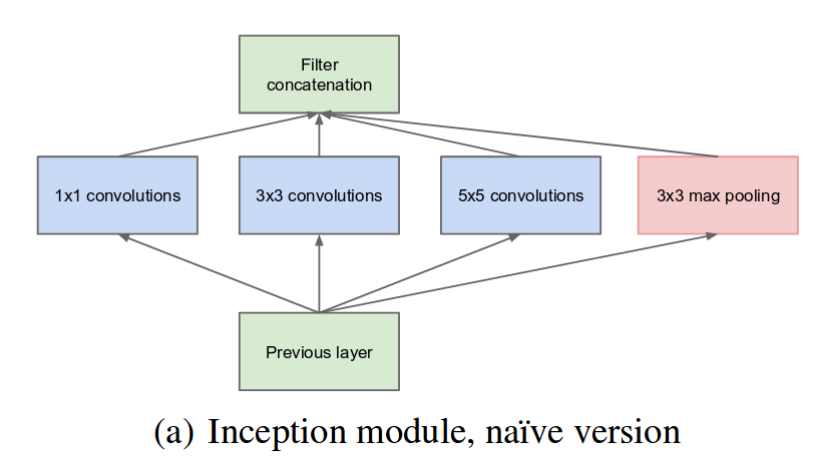
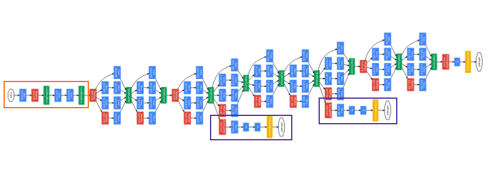

## This article is a summary of knowledgeabout Inception_Network
### Reference: 
   1. Medium: A Simple Guide to the Versions of the Inception Network (https://towardsdatascience.com/a-simple-guide-to-the-versions-of-the-inception-network-7fc52b863202)
   2. Inception v1 (https://arxiv.org/pdf/1409.4842v1.pdf)
   3. Inception v2 and Inception v3 (https://arxiv.org/pdf/1512.00567v3.pdf)
   4. Inception v4 and Inception-ResNet. (https://arxiv.org/pdf/1602.07261.pdf
   
   
### Inception v1 -----> GoogleNet
   1. Naive version  
      

          
      

   2. Inception module with dimension reductions   
      

           
      

   3. GoogleNet, has 9 such inception modules stacked linearly, It is 22 layers deep (27, including the pooling layers). It uses **global average pooling** at the end of the last inception module.
   
      1. Auxiliary loss 
         1. To prevent the middle part from 'dying out', so the authors introduced two __auxiliary classifiers__　
         2. Loss function  
            total_loss = real_loss + 0.3 * aux_loss_1 + 0.3 * aux_loss_2
         3. Auxiliary loss is purely used for training purposes, and is ignored during inference.
         
### Inception v2
   1. Factorize 5x5 convolution to two 3x3 convolution
      1. improve computational speed   --->   a 5x5 convolution is __2.78 times__ more expensive than a 3x3 convolution   --->  stacking two 3x3 convolutions infact leads to a boost in performance
      

         
      

   2. Moreover, they factorize convolutions of filter size n\*n to a combination of 1\*n and n\*1 convolutions
      1. Example: 3\*3 = 1\*3 combine with 3\*1   ----->  this method to be __33% more cheaper__ than the single 3x3 convolution
      

         
      
  
   3. filter bank: the module were expanded (made wider instead of deeper)
   

      
      
   

   
### Inception v3
