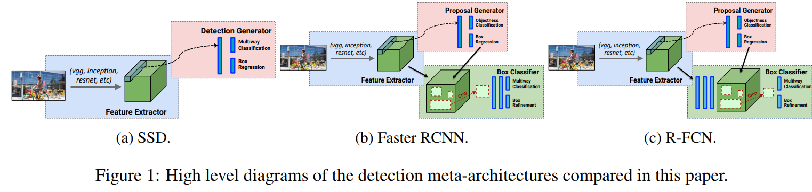
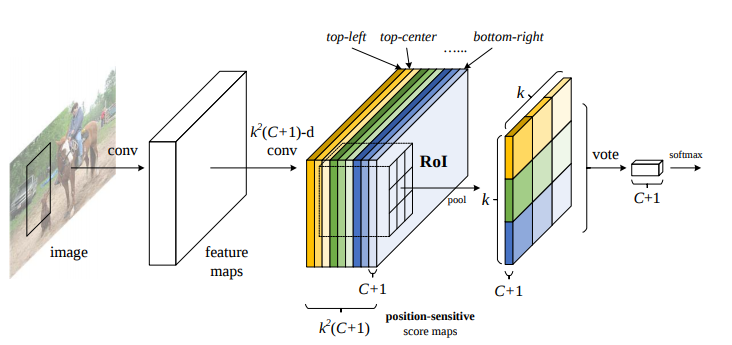
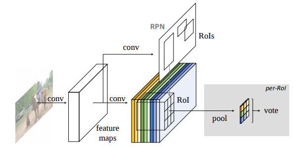
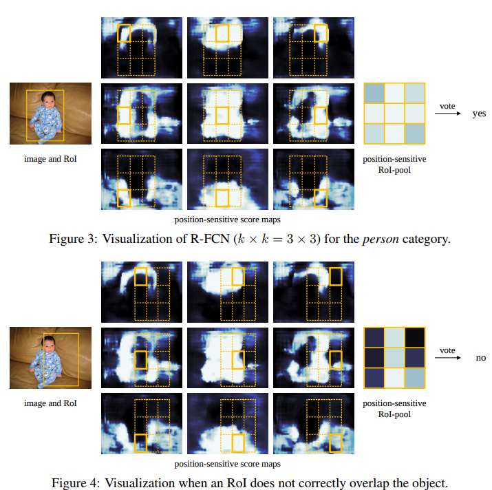

# R-FCN
2018.07.05  第一次撰写，因为怕忘记刚刚突然理解的结构 (没读论文，网上看博客，自己的领悟)

Paper: R-FCN: Object Detection viaRegion-based Fully Convolutional Networks (https://arxiv.org/pdf/1605.06409.pdf)

## Contribution
1. Instead of cropping featrues from the same layer where region proposals are predicted, crops are taken from the last layer of features prior to prediction.　在获得RoIs之后先不crop，对整个image的每个FM(feature maps)求k×k个FMs,然后根据之前得出的RoIs, crop得到的FMs，这样不用对每个RoIs都求一次k×k的FMs.从而减少计算量和时间，如下图所示，SSD, Faster R-CNN, R-Fcn的区别。  ------From paper (http://openaccess.thecvf.com/content_cvpr_2017/papers/Huang_SpeedAccuracy_Trade-Offs_for_CVPR_2017_paper.pdf)  

2. Position-sensitive score maps: 下面有详说

## 1.Overall architecture of R-FCN

首先，输入一张图片，用RPN提取得到ROIs.接下来对一张图片中每一个ROI(Region-of-Interest)进行position-sensitive score maps generation(这一步是R-fcn的key idea)得出k*k*(c+1)的map. 最后把k*k*(c+1)-->1*1*(c+1)，然后softmax得出probability最高的class为目标的class.

## 2.分步来讲每个步骤

#### 首先搞清楚每个参数的意义:
1. k: size of position-sensitive score maps, 这里我们assume用3*3，所以本例中k=3
2. c: the number of classes. 我们用c+1做计算是因为加了一个背景类。比如我们想detect一张图片里的：人，车。则c=人+车＝2,c+1=人+车+背景＝2+1=3.
3. 为了便于理解，我们使用people作为检测目标。
#### 细讲position-sensitive score maps
首先看 Fig 1.,懂得R-CNN到Faster R-CNN的都明白RPN网络(region proposal network)，这里先不细讲。一张input image经过RPN之后，会在这张image里得到一个或者多个ROIs--->一张image里有一个或者多个人; 也可能0个ROIs,整张input image里没有人.　这里我们可以对每个一个ROIs都进行一次position-sensitive score maps的计算，但是如果这样的话，会消耗很多精力。所以R-fcn的做法是在的到ROIs之前，对图像的每个feature map再分成k*k张feature maps，本例中为3*3=9个feature maps(也就是Fig 1.and Fig 2.中９种颜色的block--->此时每块同颜色的block的厚度是c+1).

那么不同的颜色块又有什么区别呢？看图fig 1.对不同颜色block有标注(top-left, top-center, ..., bottom-right)，第一张黄色的feature map其实就是一张概率图，相对于我们检测目标(eg.用一个框在检测人时，这个框所的左上部分包含的内容)的top-left的位置，input image中越接近检测目标的top-left,则所得概率图中value越大-->表示input的图中每个区域是检测目标的top-left的概率。第二张淡黄色的feature map是检测目标的top-center的概率.第三张是最淡的黄色的那张feature map则对应top-right;绿色淡绿色最淡绿色分别对应第四第五第六张，分别对应middle-left, middle-center, middle-right；蓝色淡蓝色最淡的蓝色分别对应第七八九张，分别对应bottom-left, bottom-center, bottom-right.

上图图figure3和figure4是一个例子(correct and not correct)，一个input image(包含一个RoI),中间9层feature maps,分别对应上段中提到的９种颜色block(这里制定某一c的情况).由于RoIs我们早已得知，在算出所有feature map的各9个概率图之后，再看Fig 1. 中，黄色块作为top-left, 淡黄色作为top-center,最淡黄色作为top-right,绿色和蓝色块也以此类推。从而从k*k个c+1厚度的block ----->>> c+1厚度的k*k格子(k*k个value)。

最后讲一讲softmax,经过上面的处理，我们现在有c+1个类，每个类都有９个value.先将9个value pooling成１个value. 然后比较在range(c+1)中，哪一个class的value最大，从而得出object的class.

