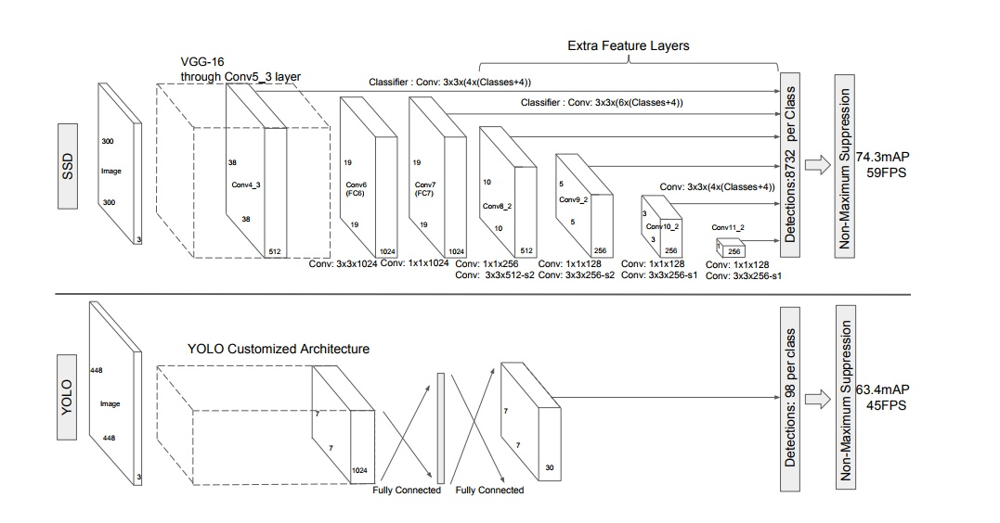

2018.07.06 现在谈一谈对ssd的理解，为什么ssd对size小物体敏感的低，性能不好。

### 话语摘录：　

  1. 针对YOLO和Faster R-CNN的各自不足与优势，WeiLiu等人提出了Single Shot MultiBox Detector，简称为SSD. https://zhuanlan.zhihu.com/p/32929487

  2. SSD网络中分为了6个stage，每个stage能学习到一个特征图，然后进行边框回归和分类. (如fig 1.) https://zhuanlan.zhihu.com/p/32929487

      1. SSD网络以VGG16的前5层卷积网络作为第1个stage (虚线框内)
    
      2. 然后将VGG16中的fc6和fc7两个全连接层转化为两个卷积层Conv6和Conv7作为网络的第2、第3个stage
    
      3. SSD网络继续增加了Conv8、Conv9、Conv10和Conv11四层网络，用来提取更高层次的语义信息 
    

