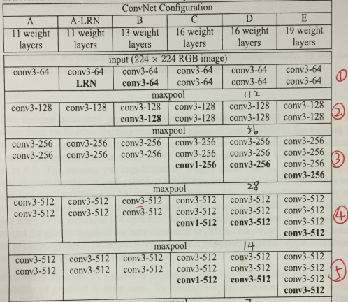
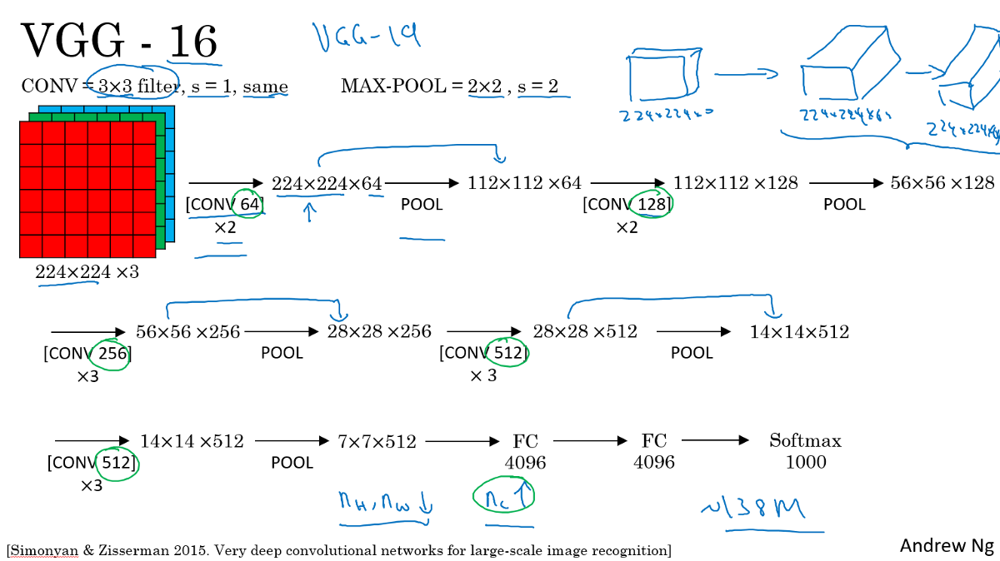

# VGG16 
2018.07.07 在准备SSD的资料时，发现自己对VGG16的了解尚存疑虑，这里补充学习一下

### 如何看神经网络官方数据表格，以VGG16为例：
  
Conv3-512   →    第三层卷积后维度变成512；  
Conv3_2 s=2     →     第三层卷积层里面的第二子层，滑动步长等于2（每次移动两个格子）  

### Architecture
  1. VGG16分为16层

