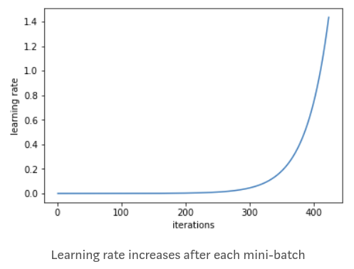
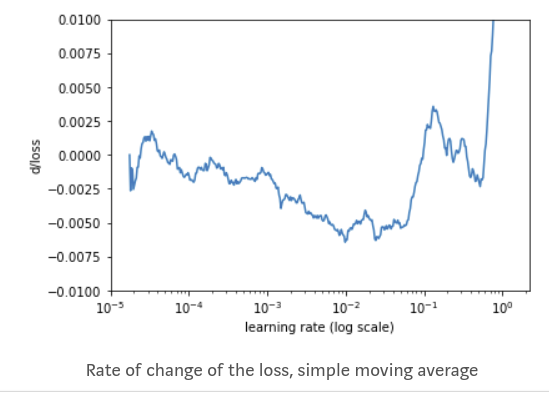

## Reference:
  1. Medium: Estimating an Optimal Learning Rate For a Deep Neural Network (https://towardsdatascience.com/estimating-optimal-learning-rate-for-a-deep-neural-network-ce32f2556ce0)

### The learning rate is a hyper-parameter of DNN, These are some methods to find suitable LRs,
  1. Paper: __Cyclical Learning Rates for Training Neural Networks__ (https://arxiv.org/pdf/1506.01186.pdf)+refernen[1]
   1. Train a network starting from a low learning rate and increase the learning rate exponentially for every batch
      

          
      

      
   2. record the LR for every batch. Plot the loss and LR. select a point on the graph with the fastest decrease in the loss
      

          
      

      
   3. Another way: calculating the rate of change of the loss (a derivative of the loss function with respect to iteration number)
      

          
      

