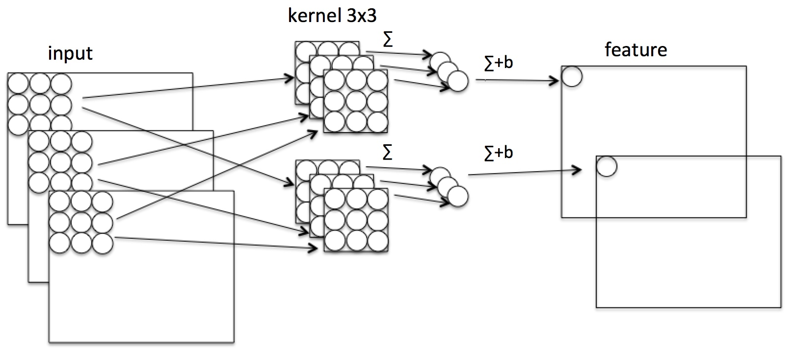
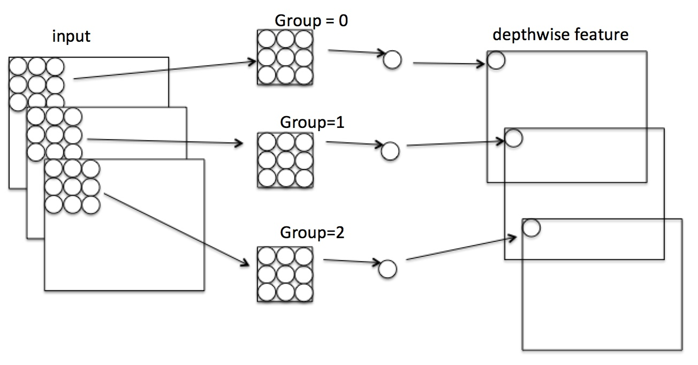
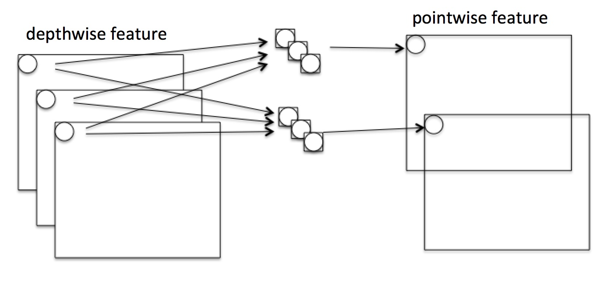
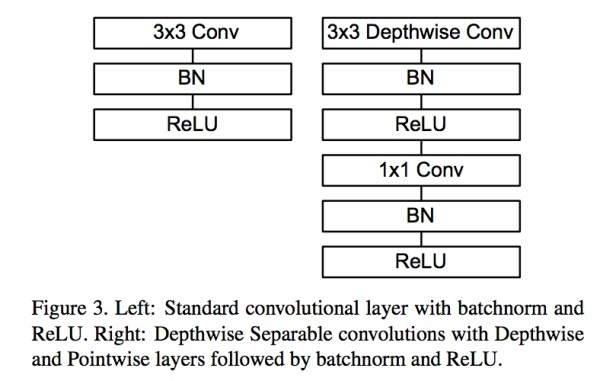
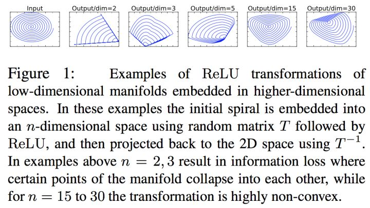

## Reference  
此文章为reference中原文加上+个人看法
  1. 知乎：轻量化网络ShuffleNet MobileNet v1/v2 解析（https://zhuanlan.zhihu.com/p/35405071）
  2. 为移动 AI 而生——旷视(Face++)最新成果 ShuffleNet 全面解读（http://www.sohu.com/a/156321743_418390）
## 摘录
  1. 在实际应用中CNN应用受限于硬件与存储, 如不能在无人机上挂几张Nvidia Titan Xp. (Ref 1)

## 细说 (MobileNet V1 -> ShuffleNet v1 -> MobileNet v2 -> ShuffleNet v2)
### Group convolution
1. What is Group Convolution?
### MobileNet V1
1. Contribution: 用Depthwish+Pointwise代替传统卷积，输出维度相同，计算量减少。
2. 传统卷积  
假设input size: N×H×W×C, kernel: 3×3×k (注：N:batch_size, H: image height, W: image weight, C: channel, k: the numbers of kernel .). If padding = 'SAME', output size: N×H×W×k

          
      

3. Depthwise  
和传统卷积同样，input size: N×H×W×C， kernel:3×3×m (下图group = C组，所以下图m=1, m由group决定)，实际意义是为了对每个channel c单独做卷积。If padding = 'SAME', output size: N×H×W×C

          
      

4. Pointwise  
和传统卷积同样，input size: N×H×W×C， kernel:1×1×k。If padding = 'SAME', 且 stride=1，实际意义是为了对input中channel c中同一位置的pixel做卷积，所以叫pointwise。 output: N×H×W×k

          
      

5. 维度、参数计算  
  1. 下图为传统和MobileNet的结构对比。 MobileNet：input先经过Depthwise再经过1×1 conv(pointwise)，其output维度变化是 N×H×W×C-> N×H×W×C ->N×H×W×k，与传统一样。

          
      

  2. 乘法次数(不是需计算的参数数量）对比,N=1时: 
    1. 传统： H×W×C×3×3×k
    2. MobileNet: Depthwise+Pointwise = H×W×C×(3×3+k)  (Depthwise: H×W×C×3×3; Pointwise: H×W×C×1×1×k) 
    3. MobileNet:传统 = (3×3+k): 3×3×k = (9+k)/9k

### ShuffleNet v1
1. Contribution:  ？？？

### MobileNet v2
1. 概括: v2主要解决了V1在训练过程中非常容易**特征退化**的问题，V2相比V1效果有一定提升
2. v1有两个问题
    1. 问题1： ReLU造成的低维度数据坍塌(collapses)： 当映射维度 m={2, 3} 时，数据坍塌；当 m>15 时，数据基本被保存，如图。虽然这不是严格的数学证明，但是至少说明：**channel少的feature map不应后接ReLU，否则会破坏feature map**。  
  

          
      
  
      
  2. 问题2： 没有复用特征:某个卷积节点weight的值变为0就会“死掉”,因为对于任意输入，该节点的输出都是0.ReLU对0值的梯度是0，所以后续无论怎么迭代这个节点的值都不会恢复了。使用ResNet的结构（这一层的值不仅来自于上一层，也来自于更浅层的值）的特征复用，可以很大程度上缓解这种特征退化问题。  

  3. 补充：特征退化？；数据坍塌(collapses)？；
    
     

### ShuffleNet V1
